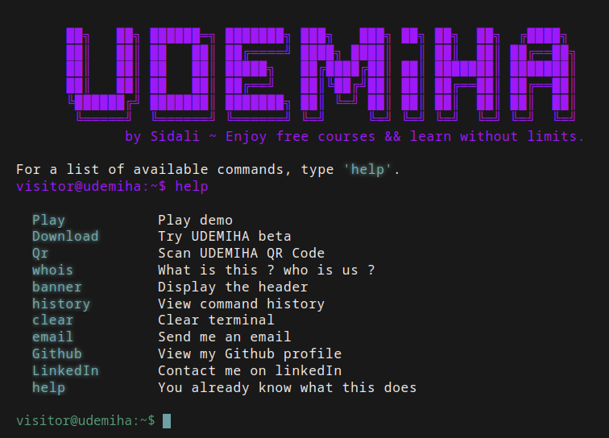
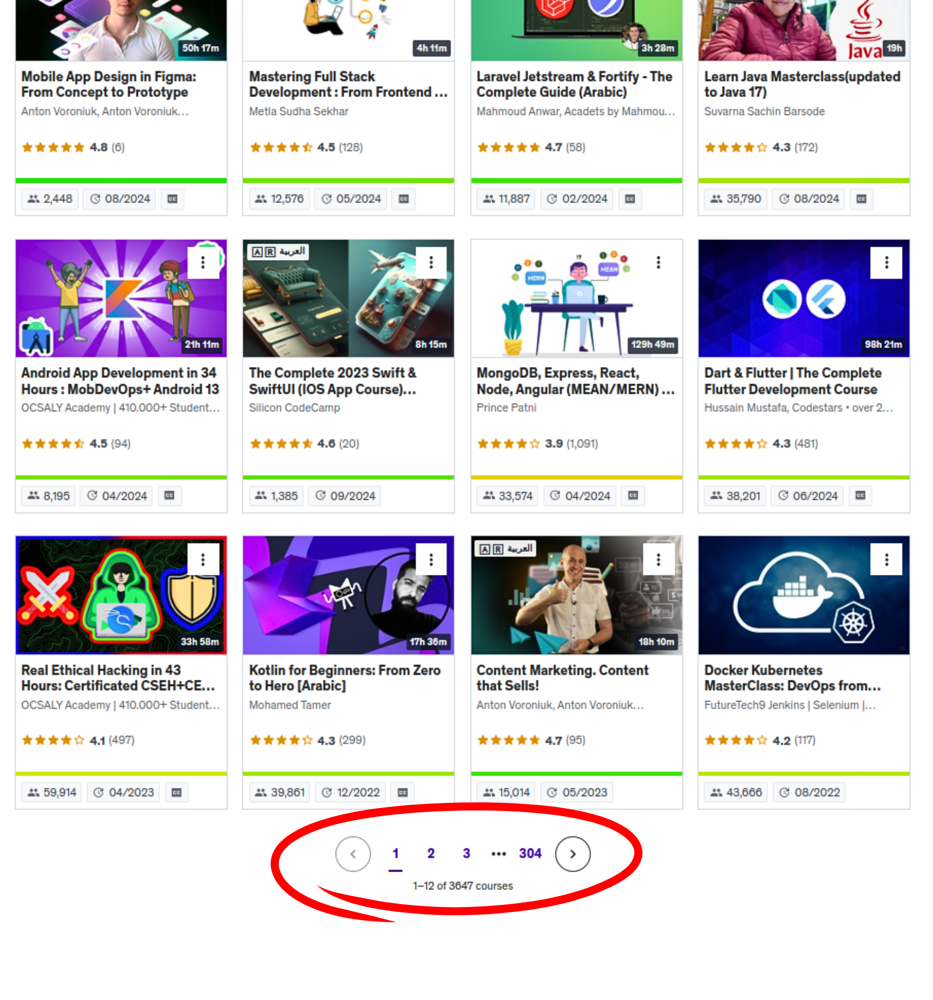

# UDEMIHA

Automate enrolling in Udemy courses using valid coupons. UDEMIHA finds deals from multiple sources, filters them based on your preferences, and enrolls you into courses safely.


## Screenshots





## Features
- Scrapes coupon deals from multiple sites (configurable in `udemiha/settings.json`).
- Filters by categories, languages, minimum rating, and keywords to exclude.
- Enrolls using credentials or existing browser cookies.
- Saves enrollment results and summaries to text output.

## Requirements
- Python 3.8+ (Windows, Linux supported; Android via termux planned).
- Dependencies listed in `udemiha/requirements.txt`:
  - `rookiepy == 0.5.3b0`
  - `cloudscraper`
  - `bs4`
  - `requests`
  - `html5lib`
  - `pyopenssl`
  - `colorama`
  - `tqdm`

## Installation
Install Python dependencies with pip (recommended inside a virtual environment).

```bash
# From the project root
python -m venv .venv
\.venv\Scripts\activate  # Windows
# source .venv/bin/activate  # Linux/macOS
pip install -r udemiha/requirements.txt
```

## Configuration
Edit `udemiha/settings.json` to match your preferences:
- `categories`, `languages`, `sites`: Toggle sources and content types.
- `min_rating`: Only enroll in courses above this rating.
- `instructor_exclude`, `title_exclude`: Skip certain instructors or keywords.
- `email`, `password`: Udemy credentials (use with care; do not commit personal credentials).
- `use_browser_cookies`: Use your logged-in browser cookies instead of credentials when possible.
- `save_txt`, `discounted_only`: Control output saving and deal filtering.

## Usage
Run the automation script from the project root:

```bash
python udemiha/udemiha.py
```

The script will scrape configured sources, enroll into matching courses, and print a summary (successfully enrolled, amount saved, already enrolled, expired).

## Demo
- Live website: https://udemiha.netlify.app/
- Beta (website): https://bit.ly/Udemiha

## Optimizations
Work in progress: cross-platform support for Windows, Linux, and Android, enabling enrollment from your phone.

## Troubleshooting
- Login issues: set `use_browser_cookies` to `true` or verify credentials/2FA in Udemy.
- Install errors: upgrade pip (`python -m pip install --upgrade pip`) and retry installing `udemiha/requirements.txt`.
- Scraping blocked: ensure `cloudscraper` is installed and up to date.

## Notes
- Respect Udemy terms and site policies; only use valid, public coupons.
- Keep `settings.json` private if it contains personal credentials.